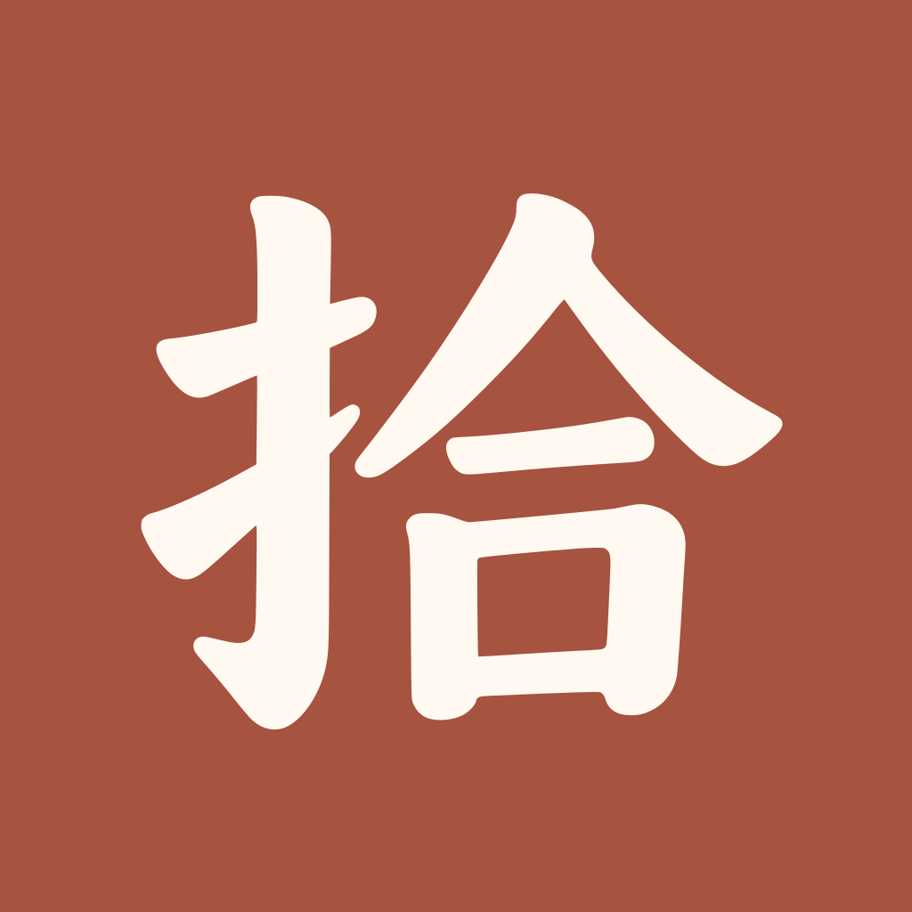

# 拾字应用图标

采用 2026-09-25 确认的 A 方案：朱红底、米白定制“拾”字。与原有蓝底字标相比，保留品牌字形识别，调整笔画轮廓与留白，并与简化版界面的温暖配色协调。

## 可编辑矢量源稿

**`app-icon-source.svg` 是当前唯一导出母版。** 它包含一个背景矩形和四个可编辑字形路径，使用贝塞尔曲线；不包含嵌入 PNG、字体、滤镜、脚本或外部资源。



在 Figma、Illustrator 或 Inkscape 中导入 SVG 后，可以编辑节点、调整形状或改变填色。各部分名称：

| 元素 ID | 内容 |
|---|---|
| `background` | 朱红背景 `#A6533F`；系统负责最终外形裁切 |
| `hand-radical` | 左侧提手旁的连通轮廓 |
| `he-roof` | 右侧顶部撇捺 |
| `he-horizontal` | 中间横画 |
| `he-mouth` | 下方口形，外轮廓与内部留白使用复合路径 |

四个字形路径在 `shi-glyph` 分组中，统一填色为 `#FFF9F1`。这是按连通形状整理的 Logo 轮廓，不是按汉字书写顺序拆分的笔顺数据。

`app-icon-reference.png` 保留用户确认的 1254×1254 RGB 位图，仅作为外观参考，不参与图标导出。原方案由 OpenAI 图像生成工具制作；本次依据它描摹曲线，并统一为两种纯色，消除位图中的细微纹理和颜色噪声。

## 重新导出 PNG

安装项目已有的 Playwright 依赖和浏览器后运行：

```bash
pnpm install --frozen-lockfile
pnpm exec playwright install chromium
node scripts/generate_app_icons.js
```

也保留原有命令：

```bash
bash scripts/generate_app_icons.sh
```

两种命令执行同一个导出器，不再依赖 macOS `sips`。优先使用 `CHROME_PATH` 指定的浏览器或本机 macOS Chrome／Chromium；其余环境使用 Playwright 的 Chromium。每个尺寸从 SVG 独立渲染，以目标尺寸的 4 倍超采样后缩小，平滑边缘；不会把小尺寸 PNG 放大作为大图。输出：

- 根目录 `icon-180.png`、`icon-192.png`、`icon-512.png`，分别供 Apple touch icon、网页图标和 Web manifest 使用。
- `ios/ShiziApp/ShiziApp/Assets.xcassets/AppIcon.appiconset/` 中的 40、58、60、80、87、120、180、1024 像素图标，与现有 `Contents.json` 对应。

SVG 的坐标画布为 1254×1254，默认显示 1024×1024。主体保持在以画布中心为圆心、半径为边长 40% 的安全圆内；512 图标继续用于 manifest 的 `any` 和 `maskable`。导出文件保留完整正方形背景，不预先裁圆角。

## 更新注意

根目录图标由 iOS 的 `sync-web-assets.sh` 自动同步到 Web bundle，原生桌面图标由 asset catalog 提供。

Web 图标使用已有稳定路径，因此替换图像时同步更新 `index.html` 的 `shizi-asset-build` 和 `sw.js` 的 `BUILD`，使新的 service worker 安装一套新的离线资源缓存。此改动不涉及 localStorage 中的用户练习数据。

后续调整请编辑 SVG 后重新运行导出器。不要分别修改各尺寸 PNG；不要将参考 PNG 塞入 SVG 代替曲线路径。
