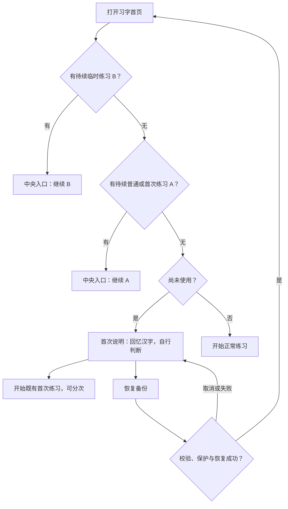
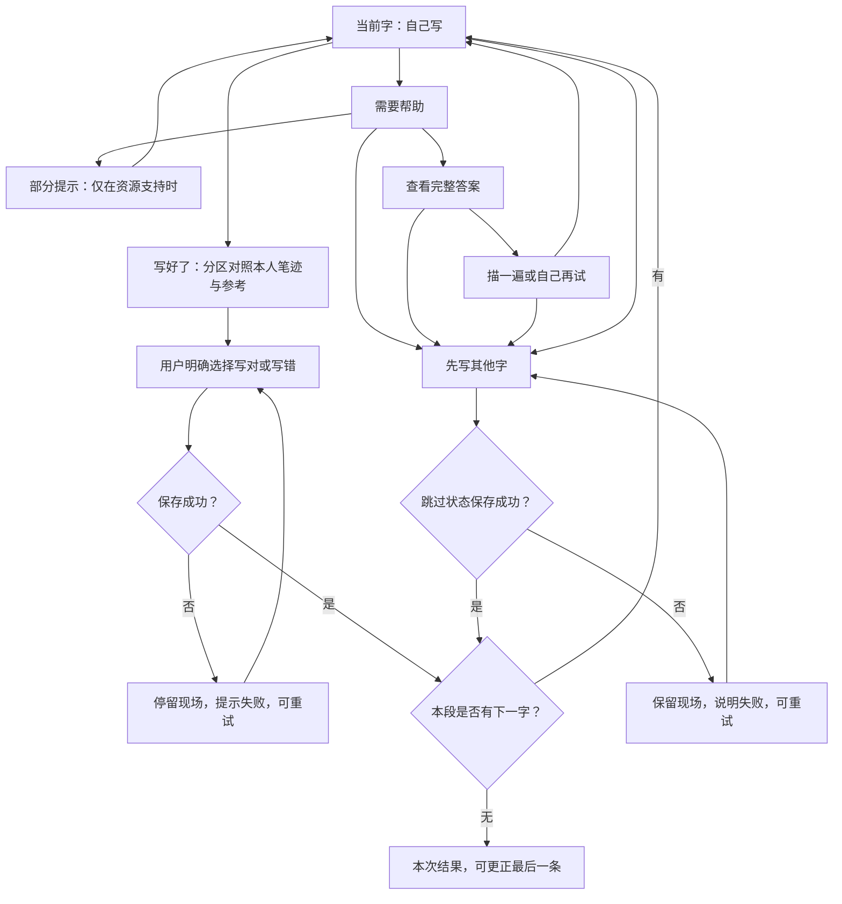
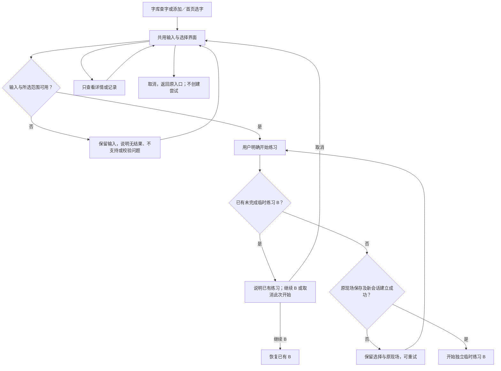
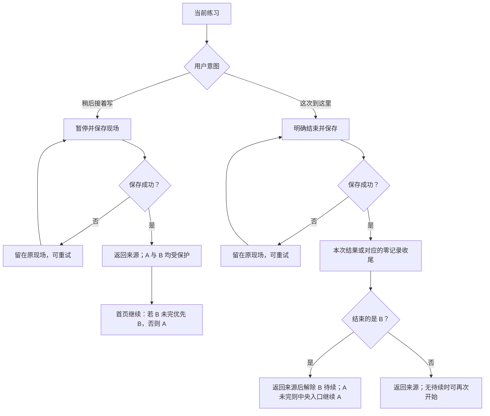

# 04 · 用户旅程与信息架构

版本：接手整理版 · 2026-09-27。保留前期资料的 G/E/H/R/J/O 编号；已按本 session 最新决定更新。来源与适用边界见 [总览](README.md)。

## 1. 结构原则

1. 习字承接直接开始和继续；字库承接查、选、添加；我的承接回顾、设置与数据管理。
2. 每一处入口说明用户要做的事；共用组件不要求所有入口都用同一个名字。
3. 页面、弹层、状态分别登记。失败样例、空态和评审辅助面板不是新的一级页面。
4. 返回要有明确来源和状态；查询、浏览或临时练习不能悄悄替换未完成内容。
5. 这是**拟实现的用户旅程**，不是已经观察到的全体用户行为；不虚构用户情绪曲线或触点数据。[S02、S03、S06]

## 2. 信息架构

```text
拾字
├─ 习字（主 Tab）
│  ├─ 日期／弱化的标题与题记
│  ├─ 唯一中央入口：开始写字／继续写字
│  │  ├─ 首次说明 → 既有首次练习；可进入恢复备份
│  │  ├─ 正常默认练习
│  │  └─ 恢复待续练习：临时 B 优先，其次普通／首次 A
│  ├─ 辅助入口：选字练习 → 共用输入与选择弹层
│  └─ 今日记录摘要（有相应记录才显示；与待续状态独立）
├─ 字库（主 Tab）
│  ├─ 查字 → 输入／结果／详情
│  ├─ 添加想练的字 → 共用输入与选择弹层
│  ├─ 真实字库 → 当前库／目标库确认／切换结果
│  ├─ 自己添加的字预览 → 查看全部 → 单字详情
│  └─ 有记录的字预览 → 查看全部 → 单字详情
├─ 我的（主 Tab）
│  ├─ 资料与真实统计（不暗示云端账户）
│  ├─ 练习记录 → 日历／日期详情／既有补记路径
│  ├─ 需要再练 → 列表／详情／选择练习
│  ├─ 图片与报告相关入口 → 月份图片／既有年度报告
│  ├─ 练习设置 → 字库、音效、背景音、字形提示、提醒、字体等
│  ├─ 备份与恢复 → 导出／选文件／校验／覆盖确认／结果
│  │  └─ 既有清空与撤销相关状态（不新增常驻恢复中心）
│  └─ 关于
└─ 共用流程（不新增主 Tab）
   ├─ 练习：书写 → 对照与自判 → 下一字／结果
   │  ├─ 部分提示／完整答案／描写／再试／先写其他字
   │  ├─ 撤销本人笔画／清空本人书写
   │  ├─ 修改上一条判断／末字更正
   │  └─ 暂停保存／明确结束／保存失败与重试
   ├─ 单字详情：练习／记录／已有单字图片与旧照片／词语反馈及撤销
   ├─ 共用输入：识别可用字／选择范围／明确开始／取消
   └─ 图片预览与保存：本次／单字／月份；内容来源准确标注
```

此树表示功能归属，不要求所有子项都在主页面直接铺开。图片和报告的最终菜单层级沿当前结构稿评审，不能因卡片布局调整导致既有能力不可达。

底部三项导航名称、顺序、图标和选中行为统一；正文预留底栏空间。次级页和弹层返回原来源，保留搜索词、选择、滚动位置等合理浏览状态；具体保留到何时在原型中逐项验证，不承诺跨重装保存界面状态。[S06]

## 3. 主要用户旅程

| 旅程 | 触发与目标 | 主要路径 | 分支与异常 | 达成条件／需求 |
|---|---|---|---|---|
| J01 第一次写一会儿 | 新用户想试试，尚无历史 | 习字→中央入口→首次说明→开始写→对照自判→继续／停下 | 有旧备份可恢复；恢复取消／失败回首次来源；首次练习可分次 | 理解回忆与自判，能落笔和离开，不被迫一次写完；R01/R02/R13 |
| J02 安静连续地写 | 默认安排或已选字，想继续写 | 书写→对照→明确判断→保存成功→下一字／结果 | 不会写→帮助／再试／跳过；修改上一条；资源不可用；保存失败 | 无额外每字确认屏；帮助不误计、纠正不多计、想停可停；R03–R08 |
| J03 写某个想写的字 | 想查一个字或选择几个字来练 | 字库明确入口／首页选字→输入选择→明确开始→临时练习→返回来源 | 无结果与不支持分开；零选择／超限；已有 B 则不能新建 C；只读查字仍允许 | 找得到入口，选字意图明确；输入取消无尝试副作用，原进度保留；R07/R09/R10 |
| J04 暂停、回来或结束 | 被打断，或现在不想写了 | 当前练习→暂停并保存→来源／首页→中央继续；或明确结束→收尾→来源 | 保存失败留现场；B 暂停继续 B；B 结束返回后恢复 A | 返回正确字、阶段、笔迹和帮助状态；没有每日完成义务；R01/R05/R07/R08 |
| J05 看积累、再练或保存图片 | 想看看写过什么、挑字再练或留一张图片 | 我的记录／需要再练，或字库有记录→列表／详情→练习或图片 | 零记录、旧历史缺笔迹、图片生成／保存失败、已有 B 未完 | 准确解释记录；再练遵循会话保护；图片不虚构本人笔迹；R08/R10–R12 |
| J06 调整与保管资料 | 想改设置、备份、恢复或清空 | 我的→设置／备份恢复→明确动作→确认／保存→结果 | 文件损坏、校验失败、保护副本失败、覆盖失败、取消与撤销 | 后果明确，失败不覆盖或假报成功；返回原来源；R11/R12/R14 |

## 4. 关键流程图

### F01 · 首页与首次入口（J01、J04）



今日记录是独立显示条件：零记录不显示“今天 0 字”，有真实记录才展示对应摘要。不是根据“有没有待续练习”推断今天是否写过；首次恢复后的首页按实际数据重新判断。

### F02 · 连续书写、自判和帮助（J02）



- 从部分提示等帮助返回当前书写时，不因切换界面丢掉原笔迹或帮助历史；明确“再试”的清理行为与撤销、清空分别定义。进入下一字才切换到下一字的书写现场。描写、本人回忆和曾提供的帮助仍需区分。
- “写好了”形成有效判断的前提是有本人笔迹；无标准资源或参考加载失败不能伪装成完整可比对状态。保留本人笔迹，提供适用的重试或离开路径。
- 失败重试保留刚才的明确选择，不要求重新评价，也不能重复提交两次有效记录。
- 普通练习没有由 UI 新增的固定每日数量；图中“无下一字”适用于既有首次／自选范围等真实边界或明确结束，不等于“今天完成了”。
- 上一条更正更新原尝试；当前字尚未提交时入口保留，当前笔迹与帮助状态不变。完整答案不依赖仅有的隐藏手势才能到达。
- 跳过何时再出现按 O02 定案，本图不作“明天必出现”或“永不出现”的承诺。[S03、S06]

### F03 · 自选、查字和临时练习（J03）



查字允许只读访问，不因存在 B 就拦住搜索或详情。开始动作才触发会话保护。添加入口与查询入口可以共用组件，但不默认把所有输入过的字永久收进列表；具体持久化事件必须与已定规则一致。[S03、S06]

### F04 · 暂停与明确结束（J04）



“暂停”保存可续现场，“结束”收起这一段练习；两者都不是完成日任务。B 的结果页退出后不自动把用户带进 A 的下一题。[S02、S06]

## 5. 页面、弹层、状态与原稿对照

| 功能单元 | 形态与入口 | 去向及返回要求 | 既有稿组 |
|---|---|---|---|
| 三主页面 | Tab 内页面 | 主导航切换，合理保留浏览位置；首页状态按真实数据更新 | W01–W03 |
| 首次说明／恢复 | 从首次中央入口进入 | 开始首次练习；恢复取消／失败回首次来源，不出现常规用户背景 | W04 |
| 书写与对照 | 核心流程页面，帮助和更正为局部状态／弹层 | 判断成功才前进；失败留现场；离开按暂停／结束处理 | W05–W07 |
| 单字详情 | 从查字、字墙、再练或记录进入的复用详情 | 返回原词、选择或列表位置；开始练习遵循 B 守卫 | W08 |
| 输入与选择 | 按意图复用弹层，不造多套输入页面 | 取消回原入口；开始前校验与检查会话；查字不写尝试 | W09–W10 |
| 选库确认 | 字库／设置进入的目标确认 | 取消不改；成功更新当前标识；失败留原库 | W11 |
| 本次结果 | 明确结束或固定范围末尾 | 查看本次记录／末字更正／已有图片动作；返回保留来源语义 | W12 |
| 需要再练与记录 | 我的入口→列表／日历→详情 | 空态明确，无记录不伪造数字；再次练习走共用流程 | W13–W14 |
| 图片与年度报告 | 从结果、单字、记录或我的相关入口进入 | 预览、生成／保存状态；失败保留来源；不新增年度导出能力 | W15–W16 |
| 设置、关于 | 我的入口及相关直达 | 保留既有设置；返回来源，数据变更有反馈 | W17 |
| 备份恢复／清空 | 首次恢复或我的数据管理 | 保留真实来源，校验与保护副本先于覆盖；取消／失败不假报成功 | W18 |
| 通用异常和离开 | 嵌入发生问题的页面／弹层 | 错误后提供适用的重试、返回或保留现场；评审工具不带进产品 | W19 |

详细状态以当前[需求与验收标准](03-需求范围与验收标准.md) 和 [历史证据说明](../../handoff/evidence.md) 为依据。表中的 W 编号用于沿用原交付索引，不要求在最终产品显示。

## 6. 尚须在原型和用户测试中回答的问题

- 用户是否理解暂停和结束的不同，能否发现相应动作；不只是我们在规格里写清楚。
- 临时练习优先继续后，用户是否知道普通进度仍在；不能为解释规则新增一堆重复主入口。
- 部分提示、完整答案、描写、再试是否自然且无误导；资源失败时还能否保住当前内容。
- 字库中添加、查询、四库和字墙是否有清晰主次；预览＋查看全部的返回负担是否可接受。
- 无记录、全跳过、旧历史缺笔迹、保存失败时，用户是否能理解发生了什么以及下一步能做什么。
- 键盘、短屏、放大文字和较长列表下是否仍能完成同样任务。

上述问题通过 [T01–T07 研究任务](02-研究证据与验证计划.md) 及需求验收记录回答。未决业务规则沿 O01–O09 处理，不由原型作者自行补成新的产品决定。

## 7. 当前交接边界

以上是目标流程，W 编号仅用于追溯旧结构，不是第八稿页面编号。设计师另交当前页面、组件和完整交互；收到后逐条对照 [I01–I04 与连续场景](../03-interaction-handoff-checklist.md)。普通返回保存、明确结束后返回来源；实际入口由正式交互说明，不能以本流程图冒充已经完成的 UI。
